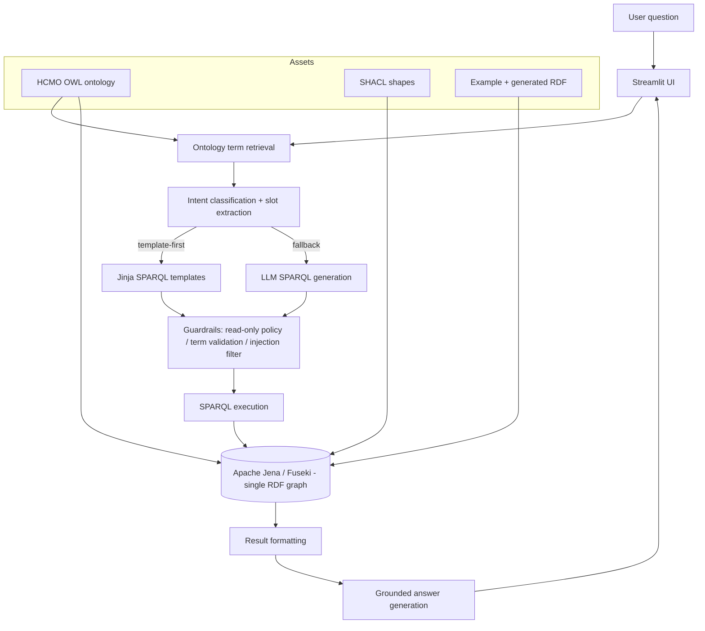

# HCMO-KGQA Lab

An ontology-native **Knowledge Graph Question Answering (KGQA)** lab for **Home
Cage Monitoring (HCMO)**. It pairs the HCMO OWL ontology with **Apache
Jena/Fuseki** as a single RDF backend and exposes everything through a
**Streamlit** UI: ontology exploration, KG loading, SHACL validation, a SPARQL
playground, and a grounded natural-language QA workflow.

> **Single-graph design principle.** HCMO-KGQA uses Apache Jena/Fuseki as the
> single RDF graph backend. The system does not maintain a secondary property
> graph representation. All ontology grounding, SPARQL querying, SHACL
> validation, reasoning, and answer generation are performed against the
> RDF/OWL graph.

**Neo4j, Cypher, and property-graph databases are explicitly NOT used.** Every
capability is implemented over RDF/OWL/SPARQL/SHACL so the knowledge stays
ontology-native and standards-based.

---

## Architecture



## Repository layout

```
hcmo-kgqa-lab/
├── app/                  # backend + Streamlit app (owned by app agents)
│   ├── core/             # config, models, logging
│   ├── ontology/         # loader, profiler, term_index, retriever
│   ├── kg/               # FusekiClient, jena_admin, graph_loader, formatter
│   ├── shacl/            # validator, report_parser, readiness
│   ├── llm/              # provider, prompts, intent, slot extraction
│   ├── guardrails/       # sparql_policy, term_validator, grounding, injection
│   ├── workflows/        # orchestration
│   └── evaluation/       # metrics + test questions
├── ontology/             # current/hcmo.owl, profiles/*.json
├── kg/                   # examples/*.ttl, generated/{asserted,inferred,merged}_kg.ttl
├── shacl/                # *.ttl shapes incl. VCG-readiness
├── sparql/               # competency_questions.yaml, examples/*.rq, templates/*.jinja.rq
├── scripts/              # pipeline scripts (this layer)
├── tests/                # pytest suite (offline-safe)
├── docs/                 # architecture + workflow docs
├── docker-compose.yml    # fuseki + streamlit
├── Dockerfile
├── Makefile
└── pyproject.toml
```

## Quickstart

```bash
# 1. Bring up Fuseki + the Streamlit UI
cp .env.example .env          # adjust LLM provider if you want NL answers
docker compose up -d

# 2. Build the demo KG: merge -> reason -> load into Fuseki
make demo

# 3. Open the app
#    http://localhost:8501
```

Local (no Docker) development:

```bash
make install          # pip install -e ".[dev]"
make fuseki-up        # just the Fuseki container
make demo             # merge + reason + load
make ui               # streamlit run app/streamlit_app.py
```

## The KGQA pipeline

1. **Ontology grounding** — retrieve relevant HCMO terms for the question.
2. **Intent + slots** — classify the competency question and extract slot values.
3. **SPARQL construction** — *template-first*: fill a curated Jinja template;
   fall back to *LLM generation* when no template matches.
4. **Guardrails** — enforce a read-only policy, validate that every term exists
   in the ontology, filter prompt injection, and require a `LIMIT`.
5. **Execution** — run the SELECT/ASK against Fuseki.
6. **Grounded answer** — generate a natural-language answer strictly from the
   returned rows; if there are no rows, say so honestly.

See [`docs/kgqa_pipeline.md`](docs/kgqa_pipeline.md) for the full flow.

## LLM provider configuration

Natural-language steps (intent, SPARQL generation, grounded answers) run
through a pluggable provider selected in `.env`:

| Provider   | `LLM_PROVIDER` | Notes                                    |
|------------|----------------|------------------------------------------|
| OpenAI     | `openai`       | `LLM_API_KEY`, optional `LLM_MODEL`      |
| Anthropic  | `anthropic`    | `LLM_API_KEY`, optional `LLM_MODEL`      |
| Ollama     | `ollama`       | local, `OLLAMA_BASE_URL`, no key needed  |
| Mistral    | `mistral`      | `LLM_API_KEY`                            |
| Gemini     | `gemini`       | `LLM_API_KEY`                            |

The template-first pipeline and all guardrails work **without any LLM key**; a
local Ollama model or a hosted provider only adds free-text intent handling and
grounded answer phrasing.

## MVP checklist

- [x] Single RDF backend (Apache Jena/Fuseki) — no property graph
- [x] HCMO OWL ontology + JSON profile/terms/prefixes
- [x] Example RDF data + merge/reason/load pipeline scripts
- [x] SHACL shapes incl. VCG-readiness validation
- [x] Curated SPARQL competency-question templates
- [x] Read-only SPARQL guardrails (policy, term validation, injection filter)
- [x] Grounded answer generation honest about empty results
- [x] Streamlit UI (explorer, loader, SHACL, playground, KGQA)
- [x] Offline-safe pytest suite
- [ ] LLM-generated SPARQL fallback fully wired end-to-end
- [ ] Evaluation harness over the full competency-question set

## Make targets

`install`, `up`, `down`, `fuseki-up`, `build-profile`, `merge`, `reason`,
`load`, `validate`, `eval`, `reset`, `demo`, `test`, `ui`, `lint`. Run
`make help` for descriptions.

## License

MIT — see [LICENSE](LICENSE).
