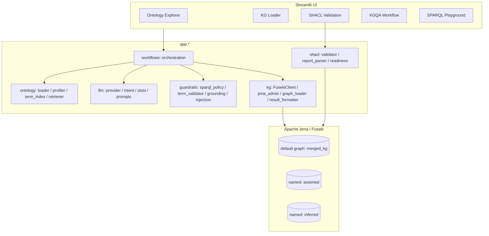

# Architecture

HCMO-KGQA is a thin, ontology-native stack over a single RDF backend. The
Streamlit UI drives a set of backend layers (`app.ontology`, `app.kg`,
`app.shacl`, `app.llm`, `app.guardrails`, `app.workflows`) that all read from
and write to **Apache Jena/Fuseki**.

> **Single-graph design principle.** HCMO-KGQA uses Apache Jena/Fuseki as the
> single RDF graph backend. The system does not maintain a secondary property
> graph representation. All ontology grounding, SPARQL querying, SHACL
> validation, reasoning, and answer generation are performed against the
> RDF/OWL graph.

There is **no Neo4j, no Cypher, and no property-graph mirror**. Choosing a
single RDF graph keeps the ontology the source of truth: terms used in queries
are exactly the terms defined in `hcmo.owl`, SHACL validates the same triples
that answer questions, and OWL/RDFS reasoning materializes into the same store.

## Component diagram

## Data flow

1. **Build** — `scripts/merge_rdf_graphs.py` unions `kg/examples/*.ttl` (and the
   ontology) into `kg/generated/asserted_kg.ttl` and `merged_kg.ttl`.
2. **Reason** — `scripts/materialize_reasoning.py` computes the OWL-RL/RDFS
   closure into `inferred_kg.ttl` and regenerates `merged_kg.ttl`.
3. **Load** — `scripts/load_to_fuseki.py` uploads the merged graph (and, with
   `--named`, the asserted/inferred graphs) via the Graph Store Protocol.
4. **Validate** — `scripts/validate_shacl.py` runs the shapes over the chosen
   graph.
5. **Query/Answer** — the KGQA workflow grounds a question in ontology terms,
   builds a guarded SPARQL query, executes it, and phrases a grounded answer.

## Reasoning

Reasoning is materialized rather than performed at query time. We prefer
`owlrl` (OWL-RL semantics) when available and fall back to an RDFS closure.
Serialization is deterministic (bound prefixes, re-parsed for validation) so
generated artifacts diff cleanly.
