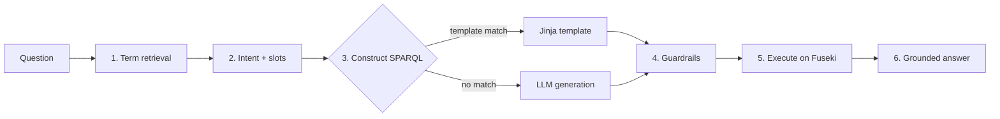

# KGQA pipeline

A question is answered by a deterministic, ontology-grounded pipeline. Two
SPARQL-construction strategies are available: **template-first** (preferred) and
**LLM-generated** (fallback). Both feed the same guardrails, execution, and
grounded-answer stages, all against the single Fuseki RDF graph.

## Stages

### 1. Ontology term retrieval
`app.ontology.retriever` / `TermIndex` perform deterministic keyword search over
`hcmo_terms.json` (camelCase-aware tokenization, token overlap + substring
bonus). This grounds the question in real HCMO IRIs before any LLM is involved.

### 2. Intent classification + slot extraction
`app.llm.intent_classifier` maps the question to a competency-question intent
(e.g. `metrics_for_experiment`, `vcg_readiness`) and `app.llm.slot_extractor`
pulls slot values (dataset IRI, species, system name, ...). With no LLM
configured, heuristic classification still routes common questions.

### 3a. Template-first construction (preferred)
Each intent maps to a curated Jinja template in `sparql/templates/*.jinja.rq`
(with embedded fallbacks in `app.workflows.templates`). Slots are rendered into
the template, producing a query that is guaranteed to use only vetted ontology
terms and shapes.

### 3b. LLM-generated fallback
When no template fits, an LLM generates a SPARQL query from the retrieved terms
and prefixes. This path leans hard on the guardrails below.

### 4. Guardrails
See [`sparql_guardrails.md`](sparql_guardrails.md). Every query — templated or
generated — must pass:
- **read-only policy** (no INSERT/DELETE/DROP/LOAD/CLEAR; `LIMIT` required),
- **term validation** (only IRIs defined in the ontology),
- **injection filter** (strip/refuse prompt-injection content),
- optional **grounding check** before answering.

### 5. Execution
`app.kg.sparql_client.FusekiClient.query` runs the SELECT/ASK against
`{FUSEKI_BASE_URL}/{FUSEKI_DATASET}/sparql` and returns a `QueryResult`
(columns, rows, count). `app.kg.result_formatter` shapes it for display.

### 6. Grounded answer generation
The answer generator phrases a response **strictly from the returned rows**.
With zero rows it produces an honest "no results" answer and marks the result
as grounded — it never invents data not present in the graph.

## Why template-first?
Templates give correctness, reproducibility, and safety for the known
competency questions, while the LLM path extends coverage to open-ended
questions. The ontology and guardrails keep both honest.
